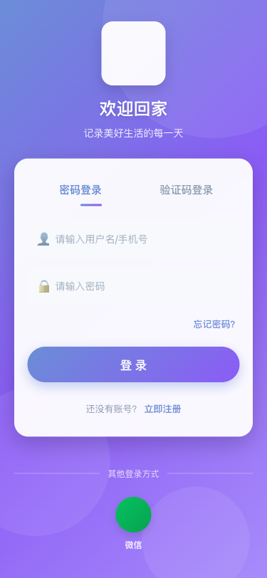
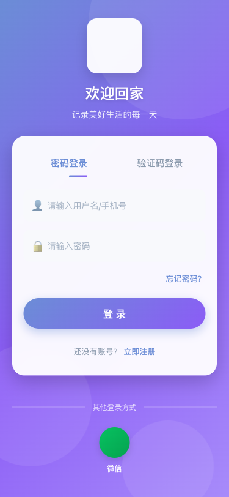

# Family App 测试报告

**测试时间:** 2026-02-23 08:43:30 ~ 2026-02-23 08:44:23

## 统计

- ✅ 成功: 5
- ⚠️  警告: 11
- ❌ 错误: 6
- 总计: 22

## 详细结果

| 时间 | 测试项 | 状态 | 说明 |
|------|--------|------|------|
| 08:43:35 | API-健康检查 | ❌ error | HTTP 500 |
| 08:43:40 | API-用户信息 | ❌ error | timed out |
| 08:43:41 | API-交易记录 | ❌ error | HTTP 500 |
| 08:43:46 | API-分类列表 | ❌ error | timed out |
| 08:43:51 | 登录页加载 | ✅ success | 页面加载成功 |
| 08:44:02 | 填写登录信息 | ❌ error | Locator.fill: Timeout 10000ms exceeded.
Call log:
  - waiting for locator("input[type=\"text\"], input[placeholder*=\"手机号\"], input[name=\"username\"]").first
 |
| 08:44:02 | 登录流程 | ❌ error | Locator.fill: Timeout 10000ms exceeded.
Call log:
  - waiting for locator("input[type=\"text\"], input[placeholder*=\"手机号\"], input[name=\"username\"]").first
 |
| 08:44:05 | 首页-收入显示 | ⚠️ warning | "收入"不可见 |
| 08:44:05 | 首页-支出显示 | ⚠️ warning | "支出"不可见 |
| 08:44:05 | 首页-余额显示 | ⚠️ warning | "余额"不可见 |
| 08:44:05 | 首页-记账按钮 | ⚠️ warning | "记一笔"不可见 |
| 08:44:05 | 首页截图 | ✅ success |  |
| 08:44:18 | 记账页-金额输入 | ⚠️ warning | 元素不可见 |
| 08:44:18 | 记账页-收支切换 | ⚠️ warning | 元素不可见 |
| 08:44:18 | 记账页-保存按钮 | ⚠️ warning | 元素不可见 |
| 08:44:18 | 记账页 | ✅ success | 页面加载完成 |
| 08:44:20 | 报表页-图表 | ⚠️ warning | 未找到图表元素 |
| 08:44:20 | 报表页 | ✅ success | 页面加载完成 |
| 08:44:23 | 我的页-头像 | ⚠️ warning | "头像"不可见 |
| 08:44:23 | 我的页-设置 | ⚠️ warning | "设置"不可见 |
| 08:44:23 | 我的页-退出登录 | ⚠️ warning | "退出"不可见 |
| 08:44:23 | 我的页 | ✅ success | 页面加载完成 |

## 截图

### 01-login-page.png
**登录页加载** - 页面加载成功

### error-login.png
**登录流程** - Locator.fill: Timeout 10000ms exceeded.
Call log:
  - waiting for locator("input[type=\"text\"], input[placeholder*=\"手机号\"], input[name=\"username\"]").first

### 04-home-page.png
**首页截图** - 

### 05-record-page.png
**记账页** - 页面加载完成

### 06-report-page.png
**报表页** - 页面加载完成

### 07-profile-page.png
**我的页** - 页面加载完成

